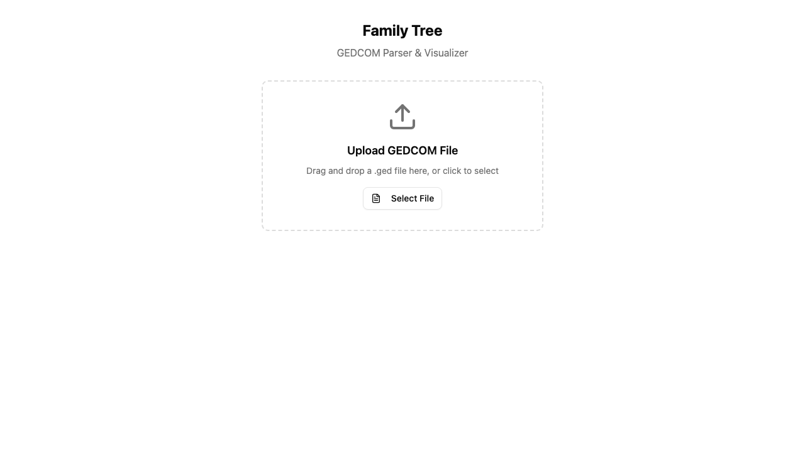

# GEDCOM Family Tree

Interactive family tree viewer with AI-powered assistant.



## Features

- Parse GEDCOM 5.5.1 files (MyHeritage compatible)
- Interactive family tree visualization (d3-dag)
- AI assistant for genealogy queries
- Responsive mobile-friendly UI

## Tech Stack

- **Frontend**: React + Vite + Tailwind + d3-dag
- **Backend**: Hono + AI SDK (Anthropic)
- **Parser**: TypeScript GEDCOM parser

## Getting Started

```bash
# Install dependencies
pnpm install

# Run frontend + backend
pnpm dev

# Run tests
pnpm test
```

## Structure

```
packages/
├── frontend/   # React UI
├── backend/    # API server
├── parser/     # GEDCOM parser
└── shared/     # Shared utilities
```
