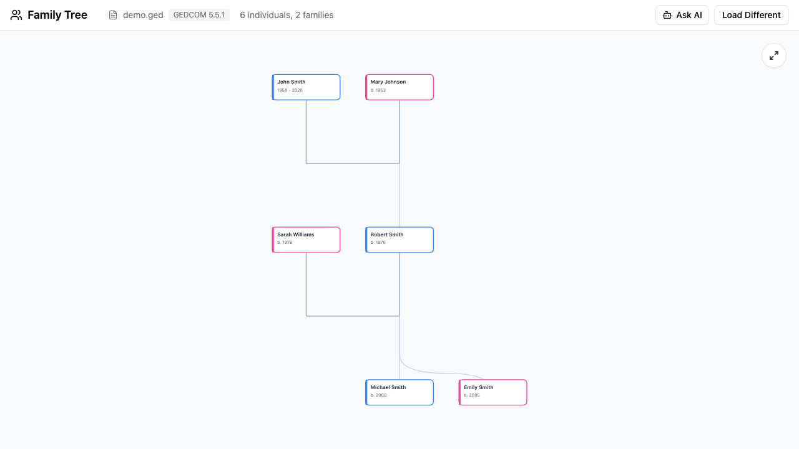

# GEDCOM Family Tree

Interactive family tree viewer with AI-powered assistant.



Try the demo: load [`demo.ged`](demo.ged) to see a sample family tree.

## Features

- Parse GEDCOM 5.5.1 and 7.0 files (MyHeritage compatible)
- Interactive family tree visualization (d3-dag)
- Map view with a playable timeline: events appear as the years pass, with
  migration paths between each person's places. Places are located from
  `PLAC.MAP` coordinates, then the ICGC geocoder (Catalan toponyms), then
  Nominatim, cached in the browser; unresolved places can be pinned by hand.
  ICGC historical orthophotos (1945 onwards) can follow the timeline.
- AI assistant for genealogy queries
- Responsive mobile-friendly UI

## Tech Stack

- **Frontend**: React + Vite + Tailwind + d3-dag
- **Backend**: Hono + AI SDK (Anthropic)
- **Parser**: TypeScript GEDCOM parser

## Getting Started

```bash
# Install dependencies
pnpm install

# Run frontend + backend
pnpm dev

# Run tests
pnpm test
```

## Structure

```
packages/
├── frontend/   # React UI
├── backend/    # API server
├── parser/     # GEDCOM parser
└── shared/     # Shared utilities
```
